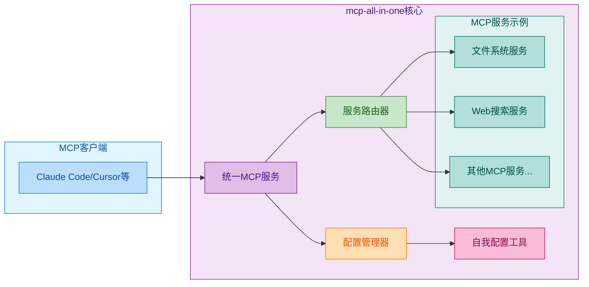
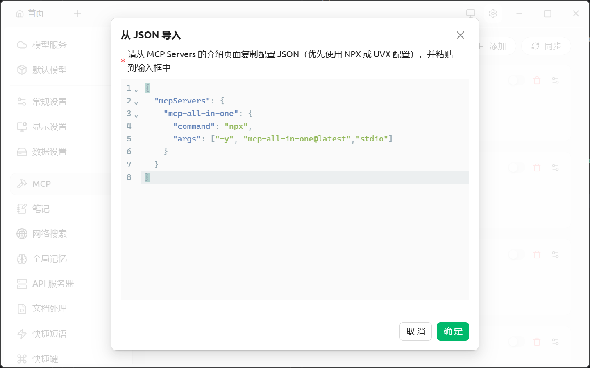
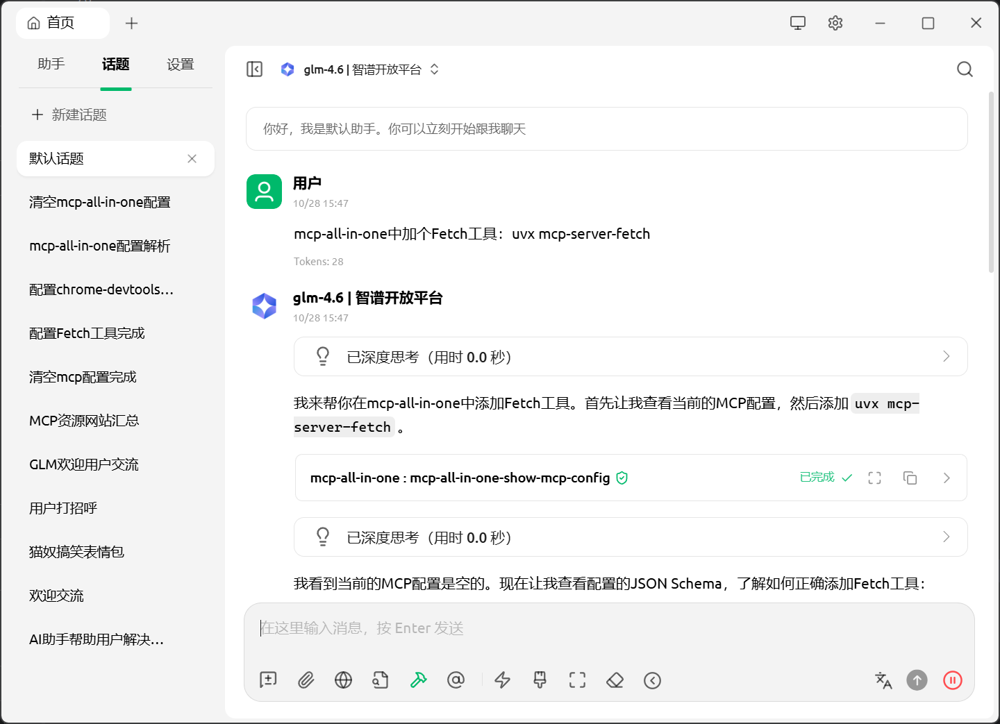
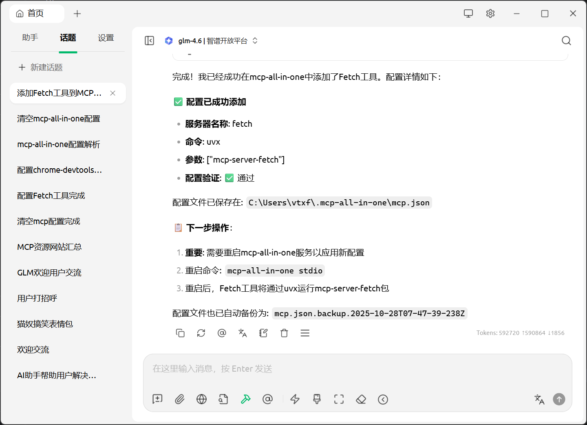
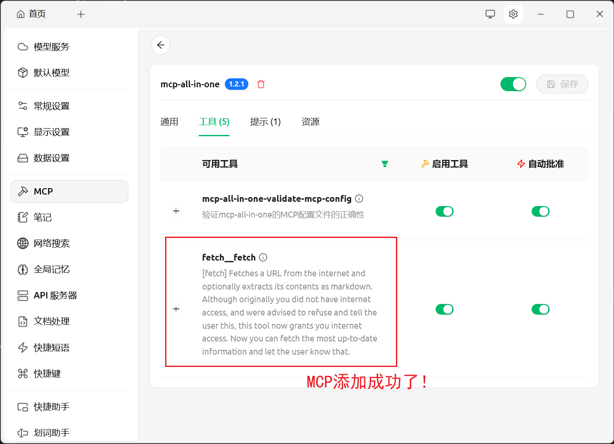

# MCP配置太痛苦？试试mcp-all-in-one!

用AI助手时，是不是被MCP配置搞得头大？每个服务都要单独设置，参数不同、协议不同，折腾半天还不一定能用。别烦了，**mcp-all-in-one** 就是来解救你的！

## 这玩意儿是啥？

简单说，**mcp-all-in-one** 就是个"万能插头"，把所有MCP服务插在一起，你只需要配置一次就够了。它还能自己配置自己，省心省力！



## 有啥厉害的？

### 🔄 一锅端所有服务

- **一个接口搞定**：把多个MCP服务合并成一个，不用一个个配了
- **两种协议都行**：stdio、HTTP都能用，随你选
- **自动路由**：工具调用自动找到对应服务，你不用管

### 🛠️ 自己配置自己

- **自带配置工具**：直接用MCP工具管理配置，不用手动改文件
- **动态配置**：随时添加删除服务
- **配置验证**：实时检查配置对不对，避免出错

### 🌟 其他贴心功能

- 🪟 **Windows友好**：自动处理Windows平台的坑
- ⚙️ **配置文件驱动**：JSON配置，简单明了
- 🛡️ **TypeScript开发**：稳定可靠
- 🔄 **自动重连**：服务挂了自动重连
- 📊 **状态监控**：实时看服务运行情况

## 三步搞定

### 1. 先装上mcp-all-in-one

Claude Code用户：
```
claude mcp add mcp-all-in-one -s user -- npx -y mcp-all-in-one@latest stdio
```

其他IDE（Cursor/Trae等）用户，在配置文件里加这个：
```json
{
  "mcpServers": {
    "mcp-all-in-one": {
      "command": "npx",
      "args": ["-y", "mcp-all-in-one@latest","stdio"]
    }
  }
}
```



### 2. 直接聊天添加工具

现在你可以直接跟AI说：

```
mcp-all-in-one中加个Fetch工具：uvx mcp-server-fetch
mcp-all-in-one中加个chrome-devtools：npx -y chrome-devtools-mcp@latest
看看mcp-all-in-one里配了啥
删掉mcp-all-in-one里的chrome-devtools工具
```






### 3. 重启MCP服务

**注意：** 每次添加或删除MCP工具后，需要手动重启MCP服务才能生效。

重启MCP服务，新工具就能用了！



---

**试试mcp-all-in-one，告别MCP配置烦恼！**