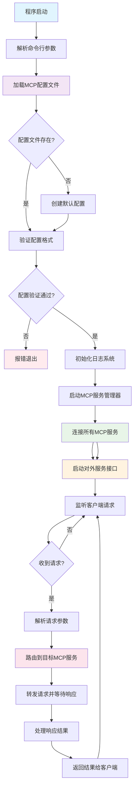
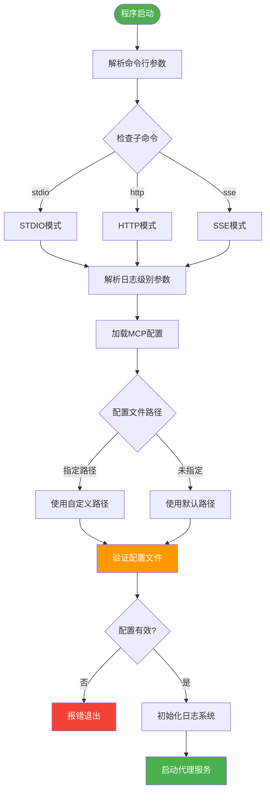
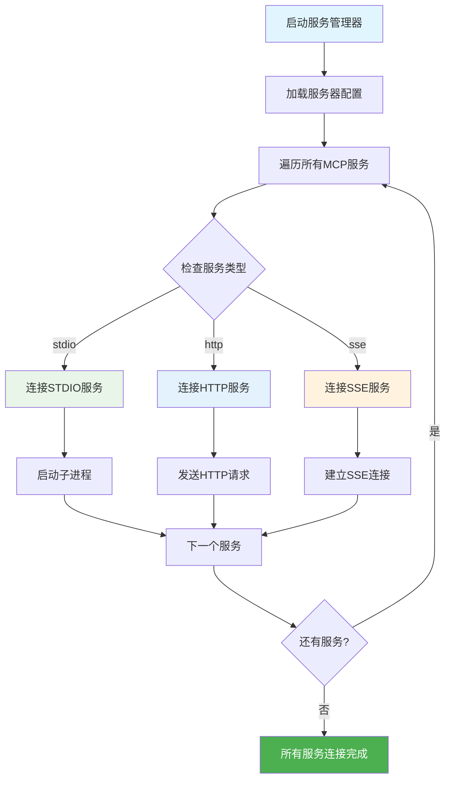
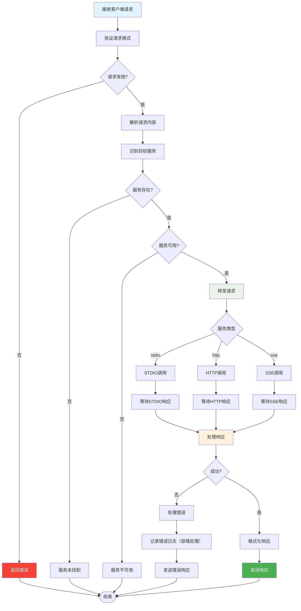
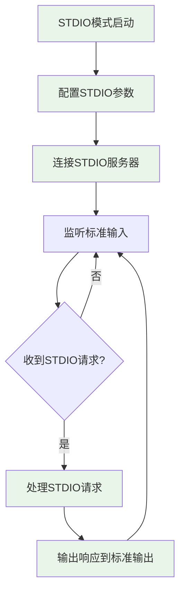
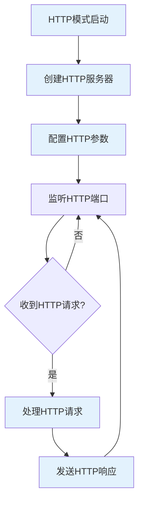
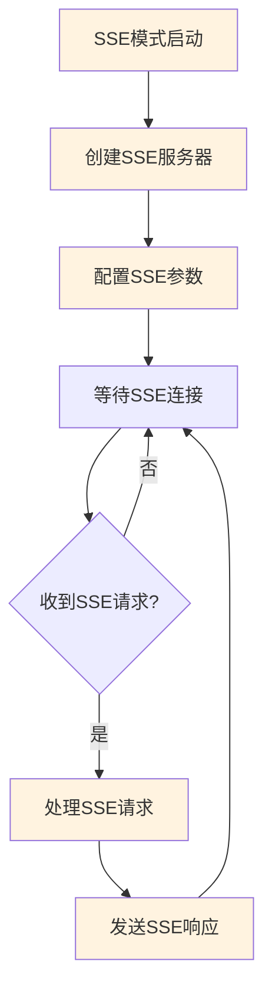
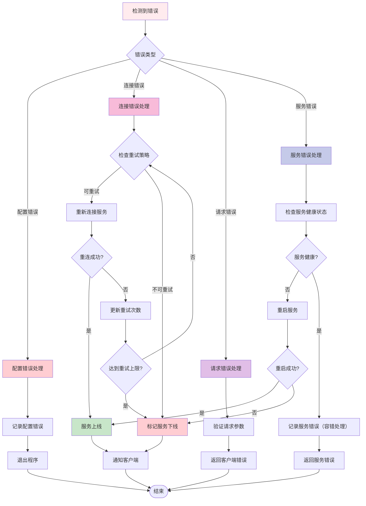

# workflow-management

## 目标
规范 mcp-all-in-one 程序的运行时工作流程，详细描述程序从启动到处理客户端请求的完整流程，包括配置加载、服务连接、请求处理和错误恢复等关键环节。

## 程序运行流程概览

## 核心运行流程

### 1. 程序启动流程

### 2. MCP服务连接流程

### 3. 请求处理流程

### 4. 不同通信模式的处理流程

#### STDIO模式处理流程

#### HTTP模式处理流程

#### SSE模式处理流程

### 5. 错误处理和恢复流程

## ADDED Requirements

### Requirement: 程序启动和初始化
程序必须提供完整的启动流程，确保所有组件按正确顺序初始化。

#### Scenario: 程序正常启动
- **WHEN** 用户执行 mcp-all-in-one 命令时
- **THEN** 程序必须解析命令行参数、加载配置文件、初始化日志系统、连接所有MCP服务并启动对外接口

#### Scenario: 配置文件缺失
- **WHEN** 指定的配置文件不存在时
- **THEN** 程序必须在默认位置创建配置文件模板并使用默认配置启动

### Requirement: MCP服务连接管理
程序必须支持多种类型MCP服务的连接和管理，提供基本的服务发现和连接机制。

#### Scenario: 多类型服务连接
- **WHEN** 程序启动时
- **THEN** 必须能够同时连接stdio、http、sse三种类型的MCP服务

#### Scenario: 服务连接失败处理
- **WHEN** MCP服务连接失败时
- **THEN** 程序必须记录错误日志并继续运行其他服务

### Requirement: 请求路由和处理
程序必须提供高效的请求路由机制，能够正确识别目标服务并转发请求。

#### Scenario: 请求路由
- **WHEN** 收到客户端请求时
- **THEN** 程序必须解析请求内容，识别目标MCP服务，并根据服务类型选择合适的通信方式转发请求

#### Scenario: 响应处理
- **WHEN** 收到MCP服务响应时
- **THEN** 程序必须处理响应格式，统一错误处理，并返回标准化的响应给客户端

### Requirement: 错误处理和恢复
程序必须提供基本的错误处理机制，确保系统的稳定性。

#### Scenario: 服务异常处理
- **WHEN** MCP服务出现异常时
- **THEN** 程序必须记录错误日志并继续运行

#### Scenario: 配置错误处理
- **WHEN** 配置文件格式错误时
- **THEN** 程序必须提供详细的错误信息并安全退出，避免使用无效配置运行

### Requirement: 多协议支持
程序必须支持stdio、http、sse三种对外服务协议，满足不同客户端的需求。

#### Scenario: STDIO模式运行
- **WHEN** 使用stdio子命令启动时
- **THEN** 程序必须通过标准输入输出通信，适合命令行工具集成

#### Scenario: HTTP模式运行
- **WHEN** 使用http子命令启动时
- **THEN** 程序必须启动HTTP服务器，支持REST API调用

#### Scenario: SSE模式运行
- **WHEN** 使用sse子命令启动时
- **THEN** 程序必须支持Server-Sent Events，适合实时通信场景

## 运行流程详细说明

### 启动阶段详细流程

1. **命令行参数解析**
   - 解析子命令（stdio/http/sse）
   - 处理配置文件路径参数
   - 解析日志级别参数（--log-level），支持：error、warn、info、debug，默认为info
   - 解析协议特定参数（端口、主机等）
   - 验证参数有效性和兼容性

2. **配置文件加载**
   - 检查配置文件是否存在
   - 不存在时创建默认配置模板
   - 使用JSON Schema验证配置格式
   - 处理环境变量替换

3. **服务初始化**
   - 使用指定的日志级别初始化Winston日志系统（具备容错性）
   - 配置日志输出格式和目标（日志系统故障不影响核心功能）
   - 处理--silent参数优先级：--silent完全禁用所有日志输出，优先级高于--log-level
   - 启动MCP服务管理器
   - 加载所有MCP服务配置
   - 建立服务连接池

4. **服务连接建立**
   - 根据服务类型选择连接方式
   - 建立连接并验证服务可用性
   - 处理连接失败和重试逻辑
   - 维护服务健康状态

### 运行时详细流程

1. **请求接收和验证**
   - 接收客户端请求
   - 验证请求格式和参数
   - 处理环境变量替换
   - 记录请求日志（容错处理，日志失败不影响请求处理）

2. **请求路由处理**
   - 解析请求目标服务
   - 检查目标服务状态
   - 选择合适的通信协议
   - 转发请求到目标服务

3. **响应处理和返回**
   - 等待并接收服务响应
   - 处理响应格式转换
   - 统一错误处理机制
   - 返回标准化响应

4. **服务状态监控**
   - 监控所有MCP服务状态
   - 检测服务异常和故障
   - 执行自动恢复策略
   - 更新服务可用性状态

### 错误处理详细流程

1. **配置错误处理**
   - 配置文件格式错误
   - 配置参数不合法
   - 环境变量缺失
   - 配置权限问题

2. **连接错误处理**
   - 网络连接失败
   - 服务启动失败
   - 连接超时处理
   - 重连策略执行

3. **运行时错误处理**
   - 请求处理异常
   - 服务响应错误
   - 资源不足处理
   - 并发冲突解决

### 配置管理详细流程

1. **配置文件加载**
   - 配置文件存在性检查
   - JSON Schema格式验证
   - 环境变量替换处理
   - 默认配置创建机制

2. **配置参数处理**
   - 命令行参数解析
   - 配置文件参数合并
   - 参数有效性验证
   - 错误配置处理

## 性能和可靠性要求

### 性能指标
- **启动时间**: 程序启动时间应在5秒内完成
- **请求延迟**: 单个请求处理延迟应在100ms内
- **并发能力**: 支持至少100个并发请求
- **内存使用**: 基础内存占用不超过100MB

### 可靠性要求
- **服务可用性**: 99.9%的服务可用性
- **故障恢复**: 服务故障后30秒内自动恢复
- **错误隔离**: 单个服务故障不影响整体服务

通过遵循这些运行流程规范，mcp-all-in-one程序将能够提供稳定、高效、可靠的MCP服务代理功能。